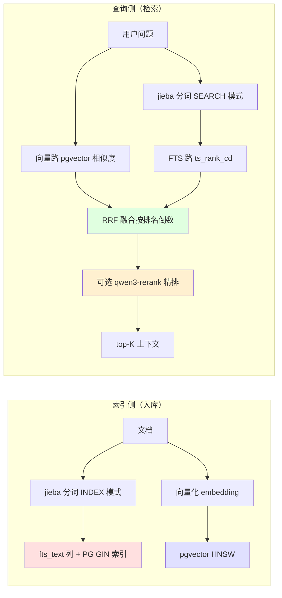

# RAG 混合检索架构文档（Hybrid Search + Rerank）

> **最后更新**: 2026-08-07
> **当前版本**: 中文全文检索 + RRF 融合 + qwen3-rerank 精排

## 📋 系统概述

知识库问答（RAG）检索从**纯向量检索**升级为**混合检索管线**：向量 + 中文全文双路召回 → RRF 融合 → cross-encoder 重排。解决纯向量检索对**精确术语不敏感**的问题（如 `@Transactional`、`JVM 调优` 这类词向量权重被稀释）。

**核心收益**：
- 精确术语召回显著改善（jieba 中文分词 + PG 全文索引）
- 语义相似仍能召回（pgvector 双路兜底）
- 两级漏斗：粗排（快、召回全）→ 精排（慢、准）
- 可量化：50+ 人工标注评测集，Hit Rate / MRR 对比

## 🏗️ 检索管线架构



### 关键设计决策

| 决策 | 方案 | 理由 |
|---|---|---|
| 中文分词 | 应用层 jieba，结果空格连接存 `fts_text` | 零扩展，不依赖 pg_jieba；PG 用 `simple` parser 按空格切词 |
| 索引侧/查询侧 | 索引用 `SegMode.INDEX`，查询用 `SegMode.SEARCH` | 索引侧更细粒度保召回，查询侧更短 token 保精确 |
| 融合方式 | RRF（Reciprocal Rank Fusion），`score = Σ 1/(k+rank)`，k=60 | 只比排名不比分数——两路分数尺度不可比，排名可比 |
| 精排 | `qwen3-rerank`（DashScope 兼容 API） | cross-encoder 精度高，只对粗排 top-20 做 |
| 降级链 | rerank 失败 → RRF 结果 → 纯向量 | 每级降级不丢数据，只为质量优化 |

## 🔌 核心组件

### 1. 中文分词器（`common/nlp/`）

```
TextTokenizer（接口）
   └── ChineseTextTokenizer（jieba 实现，@Component）
          ├── tokenize()          → SegMode.INDEX（索引侧）
          └── tokenizeForSearch() → SegMode.SEARCH（查询侧）
```

- **降级**：jieba 异常时 fallback 保留 ASCII 字母数字 + 连续汉字，英文术语仍可检索
- **线程安全**：`JiebaSegmenter` 实例无状态，单例复用

### 2. 全文检索列（Flyway V20260807）

```sql
ALTER TABLE vector_store ADD COLUMN IF NOT EXISTS fts_text TEXT;
CREATE INDEX IF NOT EXISTS idx_vector_store_fts_gin
  ON vector_store USING gin (to_tsvector('simple', fts_text));
```

- **为什么独立列**：`metadata` 由 Spring AI PgVectorStore 独占 + `promoteVectorJob` 用 `jsonb_set` 搬运，内嵌会污染既有迁移逻辑
- **回填策略**：新数据向量写入后同步回填；旧数据由 `KnowledgeBaseFtsBackfillScheduler` 每 30 秒渐进回填 50 行

### 3. 混合检索编排（`HybridSearchService`）

```
向量路 top-20（pgvector，擅长语义）
FTS 路  top-20（ts_rank_cd，擅长精确词）
    ↓ RRF 融合（去重，按排名倒数计分）
候选 top-30
    ↓ 可选 rerank（query-doc 对打分，过滤 < min_relevance）
    ↓ 补齐到 top-K
```

- `similaritySearch` 四参签名**保持不变**——出题功能仍用纯向量
- `KnowledgeBaseQueryService.retrieveRelevantDocs` 由 `app.ai.rag.hybrid.enabled` 门控

### 4. 重排序（`DashScopeRerankService`）

- 接口 `RerankService` + DashScope 实现，`@ConditionalOnProperty` 控制 Bean 创建
- **base-url 特殊**：`https://dashscope.aliyuncs.com/compatible-api/v1`（`compatible-api`，与 provider 的 `compatible-mode` 不同）
- 走 `AI_BAILIAN_API_KEY`，超时 10s，失败降级到 RRF
- 过滤低分候选：`relevanceScore < minRelevanceScore(0.5)` 丢弃

## ⚙️ 配置

```yaml
app.ai.rag:
  chunk:
    default-chunk-size: 500
    overlap: 50
  hybrid:
    enabled: false        # 默认关闭，保持纯向量行为
    top-k-vector: 20
    top-k-fts: 20
    candidate-cap: 30
    fusion: rrf
    rrf-k: 60
  rerank:
    enabled: false
    model: qwen3-rerank
    base-url: https://dashscope.aliyuncs.com/compatible-api/v1
    top-n: 10
    timeout-seconds: 10
    min-relevance-score: 0.5
```

环境变量：`APP_AI_RAG_HYBRID_ENABLED` / `APP_AI_RAG_RERANK_ENABLED` 等，生产 compose 已透传（默认关闭）。

## 📊 检索质量评测

**评测集**：`app/src/main/resources/rag-eval/questions.json`（50 题，覆盖 Java/Spring/数据库/AI 等 11 类，每题含期望关键词）

**评测指标**：
- **Hit Rate@5**：top-5 是否至少命中一个期望关键词（"有用信息是否被召回"）
- **MRR**：第一个命中的排名倒数均值（"最佳答案排多靠前"）
- **Recall@5**：期望关键词在 top-5 的覆盖比例（"检索覆盖度"）

**运行方式**（`RagEvalRunner`，`@ConditionalOnExpression("${rag.eval.run:false}")`）：

```bash
# 需先上传评测文档到知识库，记下 kbId
APP_AI_RAG_HYBRID_ENABLED=true APP_AI_RAG_RERANK_ENABLED=true \
RAG_EVAL_KB_ID=1 RAG_EVAL_RUN=true ./gradlew :app:bootRun
```

评测完成后自动 `System.exit(0)`，输出三行对比表。

## 🛡️ 降级与风险

| 场景 | 降级行为 |
|---|---|
| rerank API 429/超时/未配置 | 使用 RRF 融合结果 |
| jieba 在 Java 25 异常 | fallback 简易分词（ASCII + 连续汉字） |
| 旧数据 fts_text 缺失 | 回填调度器渐进补齐 |
| 混合检索整体失败 | `similaritySearch` 纯向量兜底 |

## 🚀 部署

- **Flyway 迁移**：V20260807 自动建列 + GIN 索引，幂等（`IF NOT EXISTS`）
- **生产 compose**：透传 RAG 开关环境变量，默认关闭不影响现有行为
- **CI**：push master → Docker 构建（JDK 25）→ 自动部署腾讯云
